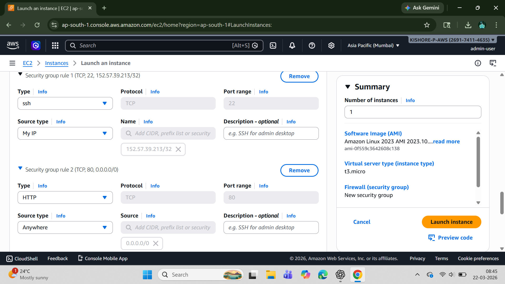
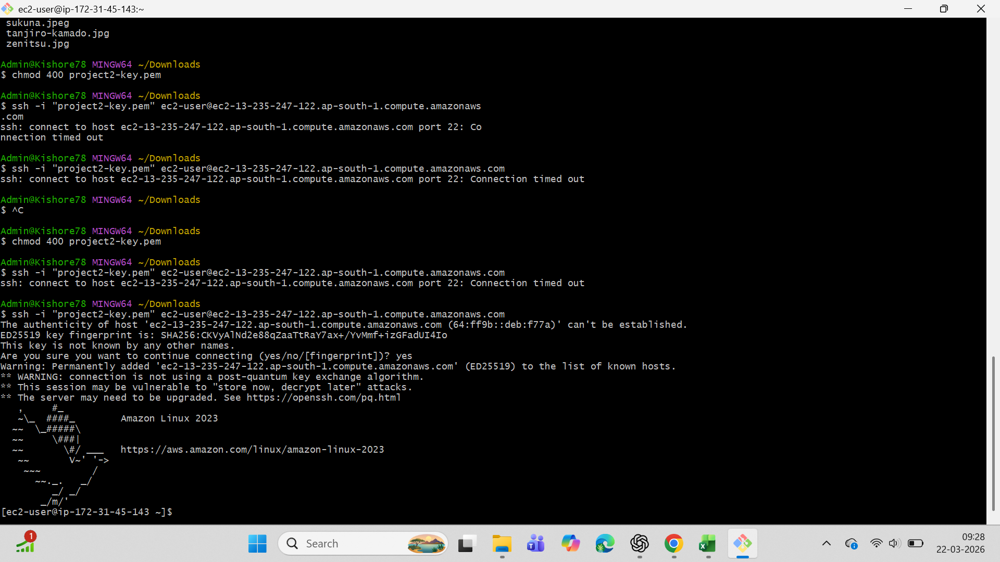

# AWS EC2 Web Server Project

## Overview :
This project demonstrates how to launch an EC2 instance and host a static website using Apache on AWS.

## Services Used :
- EC2 (Elastic Compute Cloud)
- Security Groups
- Amazon Linux 2023

## Architecture :
User → Internet → EC2 Instance → Apache Web Server → Website

## Steps Performed :
1. Launched EC2 instance (t3.micro)
2. Configured security group (SSH and HTTP)
3. Connected via SSH using key pair
4. Installed Apache (httpd)
5. Started and enabled web server
6. Created index.html file
7. Accessed website via public IP

## Commands Used :
1. sudo yum update -y
2. sudo yum install httpd -y
3. sudo systemctl start httpd
4. sudo systemctl enable httpd
5. cd /var/www/html
6. sudo nano index.html

## Screenshots :

## Learning Outcome :
1. Learning Outcome
2. Learned EC2 deployment
3. Understood security groups
4. Gained Linux command experience
5. Hosted a live website on AWS
